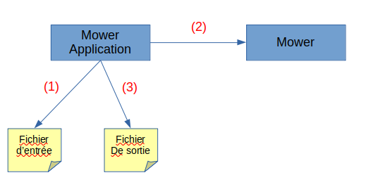
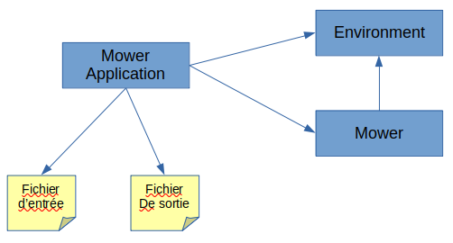

# Kata tondeuse à gazon

## Lancer les tests

`mvn clean test`

## Implémentation pas à pas

### Bootstrap du projet

tag `start`

Dans un tout premier temps, on met en place le nécessaire pour écrire des tests unitaires.

On vérifie que l'on peut lancer un test en échec: depuis l'IDE (dans mon cas IntelliJ), et via maven en ligne de commande.

### Etude du problème

Même si on fait du TDD, d'expérience, se lancer immédiatement dans le code sans avoir étudier le problème ni avoir drafté 
un modèle du domaine, du design ou d'un algorithme de haut niveau peut amener à perdre de vue la problématique en route 
et rendre le processus pénible et moins efficace.

Il s'agit de clarifier sa compréhension du problème, et les hypothèses implicites que l'on peut faire sur la manière 
dont on pense le résoudre, ce qui est, à mon humble avis, utile quand on travaille seul, 
et particulièrement important quand on travaille à plusieurs, pour aligner nos compréhensions et limiter les incompréhensions futures.

Il ne s'agit pas nécessairement de faire du "big upfront design",à suivre à la lettre. 
On autorise les tests à faire émerger un design différent de ce que l'on a conçu initialement.

Et si analyser le problème devait devenir un point de douleur et nous empêcher d'avancer, alors on se lance et on 
affinera ou rectifiera par la suite, restons agiles et pragmatiques.

#### Algo de l'application dans les grandes lignes

```
- On récupère les coordonnées du coin supérieur droit en 1e ligne
- jusqu'à la fin du fichier:
    - On crée un tondeuse à partir de la 2e (2i -ème) ligne
    - On récupère et éxécute les instructions sur la tondeuse à partir de la 3e (2i+1 -ème) ligne
    - On récupère la position de la tondeuse et on l'écrit dans le fichier de sortie
```



1. `MowerApplication` lit le fichier d'entrée
2. `MowerApplication` crée la tondeuse et éxécute les commandes dessus
3. `MowerApplication` récupère la position et l'orientation de la tondeuse pour l'écrire dans le fichier de sortie

On sépare la logique d'éxécution de la tondeuse et la lecture du fichier pour une meilleure testabilité du comportement 
de la tondeuse, et par habitude, en tant que pratiquant de l'architecture héxagonale.

### test #1 - on peut créer une tondeuse avec sa position initiale

tag `test_1_create_mower`
Pour se lancer, on crée une tondeuse avec sa position initiale et on vérifie que celle-ci est bien settée.

### test #2.1 - avancer la tondeuse quand celle-ci fait face au nord

tag `test_2_1_forward_north_without_limit`
2e test, on vérifie que la coordonnée `y` de la tondeuse augmente de 1 quand elle avance en faisant face au nord.

### test #2.2 - avancer la tondeuse quand celle-ci fait face au nord et est deja à la limite

tag `test_2_2_forward_north_with_limit`
2e test, on vérifie que la coordonnée `y` de la tondeuse augmente de 1 quand elle avance en faisant face au nord.

Refacto:

Lors de cette étape, on a modifié l'idée du design de la façon suivante:



Initialement, les limites de l'environnement étaient définies comme variables statiques de la classe `Mower`.
Après réflexion, elles ne semblent pas être des attributs des tondeuses, mais externes aux tondeuses.

L'idée de l'algo résolvant notre problème devant dans les grandes lignes quelque chose comme:

```
- On crée l'environnement à partir de la 1e ligne du fichier d'entrée
- jusqu'à la fin du fichier:
    - On crée un tondeuse à partir de la 2e (2i -ème) ligne
    - On récupère et éxécute les instructions sur la tondeuse à partir de la 3e (2i+1 -ème) ligne
    - On récupère la position de la tondeuse et on l'écrit dans le fichier de sortie
```

### test #3.1 - avancer la tondeuse quand celle-ci fait face à l'ouest

tag `test_3_1_forward_west_without_limit`

### test #3.2 - avancer la tondeuse quand celle-ci fait face à l'ouest et est deja à la limite

tag `test_3_2_forward_west_with_limit`

### test #4.1 - avancer la tondeuse quand celle-ci fait face à l'est 

tag `test_4_1_forward_east_without_limit`

### test #4.2 - avancer la tondeuse quand celle-ci fait face à l'est et est deja à la limite

tag `test_4_2_forward_east_with_limit`

### test #5.1 - avancer la tondeuse quand celle-ci fait face au sud

tag `test_5_1_forward_south_without_limit`

### test #5.2 - avancer la tondeuse quand celle-ci fait face au sud et est deja à la limite

tag `test_5_2_forward_south_with_limit`

### test #6.1 - tourner la tondeuse à gauche quand celle-ci fait face au norde 

tag `test_6_1_turn_left_facing_north`